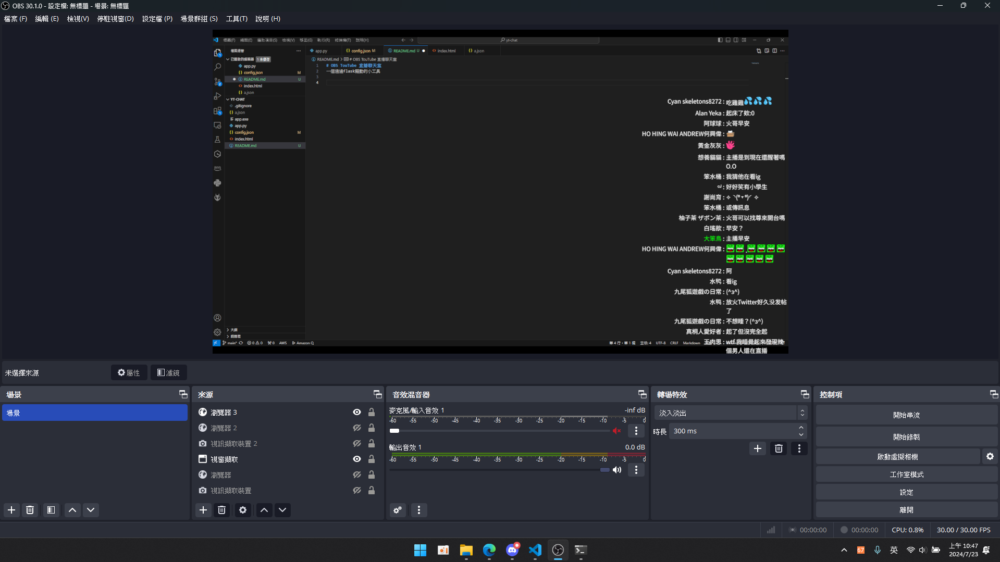
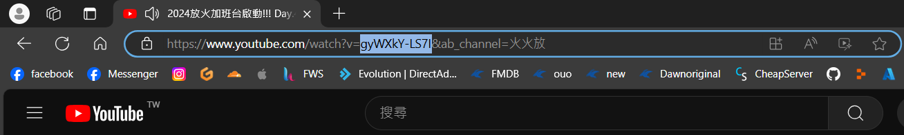

# OBS TouTube 直播聊天室
一個通過flask驅動的小工具

# 說明
這個工具的產生是因為我發現有些軟體無法顯示自訂的表情符號

# 截圖


# 安裝與設定
1. [下載此倉庫](https://github.com/HansHans135/youtube-obs-chat/archive/refs/heads/main.zip)
2. 解壓縮後打開`config.json`

```json
{
    "live_id":"gyWXkY-LS7I",  //youtube直播id (參考圖片)
    "color":{
        "isChatModerator":"#1e90ff",  //管理員名子顏色
        "isChatSponsor":"#00ff00",  //會員名子顏色
        "isChatOwner":"yellow",  //主播名子顏色
        "default":"white"  //普通人名子顏色
    },
    "message_amount":15  //訊息數量
}
```
- 直播id

- 名子顏色請使用[16進制](http://www.eion.com.tw/Blogger/?Pid=1008)或是英文

3. 運行`app.exe`
4. 在OBS中加入瀏覽器，網址為`http://localhost:15873/`
5. Enjoy!